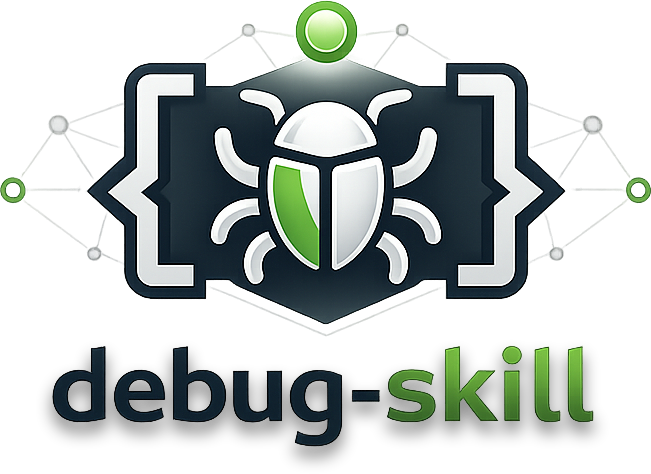

<p align="center">
  
</p>

<p align="center">
  <strong>Give your AI agent a real debugger.</strong><br>
  Breakpoints. Stepping. Variable inspection. Stack traces. All from Bash.
</p>
<p align="center">
  <a href="https://github.com/AlmogBaku/debug-skill/releases/latest"></a>
  <a href="https://github.com/AlmogBaku/debug-skill/actions/workflows/release.yml"></a>
  <a href="https://github.com/AlmogBaku/debug-skill/blob/master/go.mod"></a>
  <a href="https://github.com/AlmogBaku/debug-skill/blob/master/LICENSE"></a>
  <a href="https://github.com/AlmogBaku/debug-skill/stargazers"></a>
</p>

<p align="center">
  If this saves you a debugging session, please <a href="https://github.com/AlmogBaku/debug-skill"><strong>star the repo</strong></a> — it helps others find it.
</p>

---

AI coding agents can't use interactive debuggers — they're stuck with `print` statements and guesswork. **debug-skill**
fixes that. It ships two things:

- **A Claude Code skill** — teaches Claude *how* to debug: when to set breakpoints, how to step through code, how to
  inspect state
- **The `dap` CLI** — a stateless CLI wrapper around
  the [Debug Adapter Protocol](https://microsoft.github.io/debug-adapter-protocol/) so any agent can drive a real
  debugger from Bash

---

## The Skill

> Install the skill, and Claude debugs your code the way *you* would — not with print statements.

The `debugging-code` skill gives Claude structured knowledge of the debugging workflow: setting breakpoints, stepping
through execution, inspecting locals and the call stack, evaluating expressions mid-run. It uses the `dap` CLI as its
tool.

### Install for Claude Code

Via the plugin marketplace — no manual setup needed:

```
/plugin marketplace add AlmogBaku/debug-skill
/plugin install debugging-code@debug-skill-marketplace
```

### Install for other agents

Via [skills.sh](https://skills.sh) — works with Cursor, GitHub Copilot, Windsurf, Cline, and [20+ more agents](https://skills.sh/docs):

```bash
npx skills add AlmogBaku/debug-skill
# or: bunx skills add AlmogBaku/debug-skill
```

Or manually copy `skills/debugging-code/SKILL.md` into your agent's system prompt or context.

---

## The `dap` CLI

`dap` wraps the Debug Adapter Protocol behind simple, stateless CLI commands. A background daemon holds the session; the
CLI sends one command and gets back the full context — no interactive terminal required.

### Install

```bash
# One-liner (Linux & macOS)
bash <(curl -fsSL https://raw.githubusercontent.com/AlmogBaku/debug-skill/main/install.sh)
```

<details>
<summary>Other install methods</summary>

```bash
# Go install
go install github.com/AlmogBaku/debug-skill/cmd/dap@latest
```

Or download a pre-built binary from the [releases page](https://github.com/AlmogBaku/debug-skill/releases/latest).

</details>

### Quick Start

```bash
# Set a breakpoint and start — stops automatically, returns full context
dap debug app.py --break app.py:42

# Inspect and step
dap eval "len(items)"
dap step

# Resume or stop
dap continue
dap stop
```

Every command returns **full context automatically**: current location, surrounding source, local variables, call stack,
and program output. No follow-up calls needed.

### Usage Examples

```bash
# Python
dap debug app.py --break app.py:42

# Go
dap debug main.go --break main.go:15

# Node.js / TypeScript
dap debug server.js --break server.js:10

# Rust / C / C++
dap debug hello.rs --break hello.rs:4

# Attach to a remote debugger (e.g. debugpy in a container)
dap debug --attach container:5678 --backend debugpy --break handler.py:20

# Pass arguments to the program
dap debug app.py --break app.py:10 -- --config prod.yaml --verbose
```

### Commands

| Command                       | Description                                     |
|-------------------------------|-------------------------------------------------|
| `dap debug <script>`          | Start debugging (local or `--attach host:port`) |
| `dap stop`                    | End session                                     |
| `dap step [in\|out\|over]`    | Step (default: over)                            |
| `dap continue`                | Resume execution                                |
| `dap context [--frame N]`     | Re-fetch current state                          |
| `dap eval <expr> [--frame N]` | Evaluate expression in current frame            |
| `dap output`                  | Drain buffered stdout/stderr since last stop    |

**Global flags:** `--json` (machine-readable output), `--session <name>` (named sessions), `--socket <path>` (custom
socket path)

### Supported Languages

| Language           | Backend     | Auto-detected |
|--------------------|-------------|:-------------:|
| Python             | debugpy     |      yes      |
| Go                 | dlv (Delve) |      yes      |
| Node.js/TypeScript | js-debug    |      yes      |
| Rust / C / C++     | lldb-dap    |      yes      |

Backend is inferred from the file extension. Override with `--backend <name>`.

### How It Works

```
dap <cmd>  →  Unix socket  →  Daemon  →  DAP protocol  →  debugpy / dlv / js-debug / lldb-dap  →  your program
```

The daemon starts automatically on `dap debug` and shuts down on `dap stop` (or after 10 min idle). It's invisible — you
never manage it directly.

### Multi-Session

Multiple agents can debug independently with named sessions:

```bash
dap debug app.py  --session agent1 --break app.py:10
dap debug main.go --session agent2 --break main.go:8

dap stop --session agent1   # stops agent1 only
```

Each session has its own daemon and socket. Omit `--session` to use the default session.

---

## Contributing

PRs and issues welcome. See `claudedocs/` for architecture details and `CLAUDE.md` for code conventions.

## Support the Project

If debug-skill saves you from a painful debugging session, consider [starring the repo](https://github.com/AlmogBaku/debug-skill/stargazers) — it helps others find it and keeps the project going.

## License

MIT
